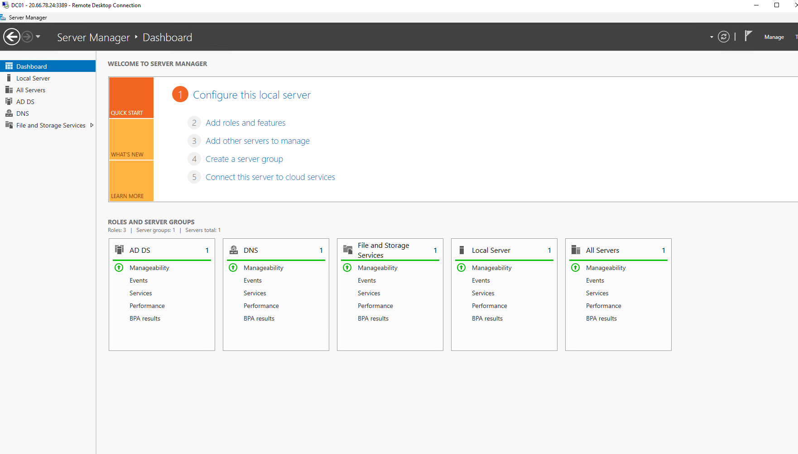
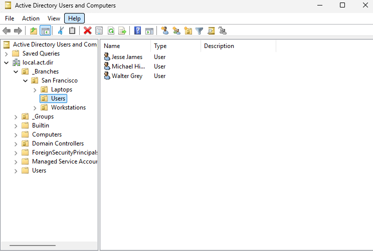
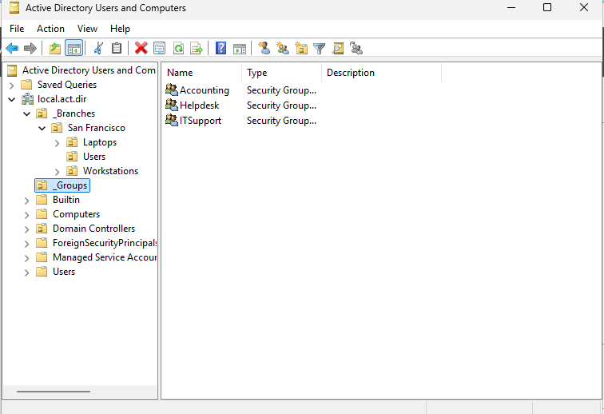
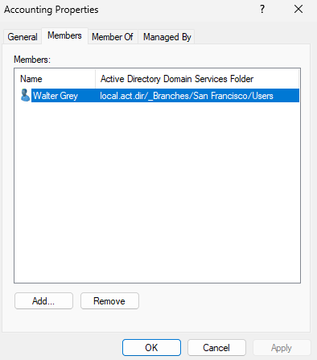
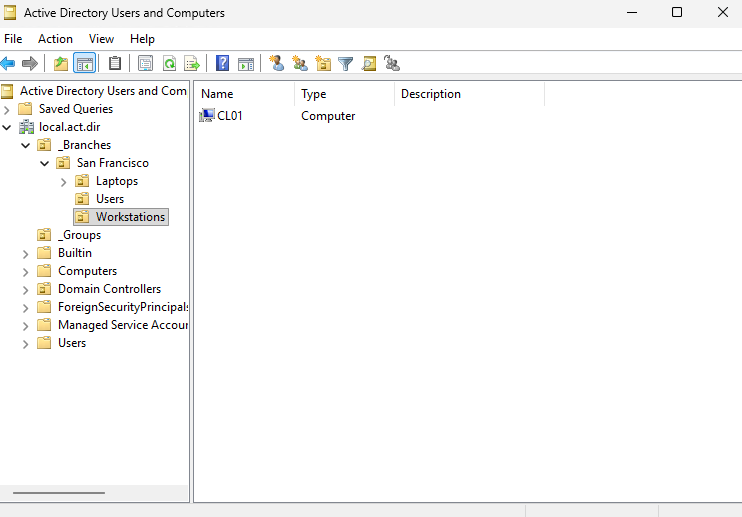
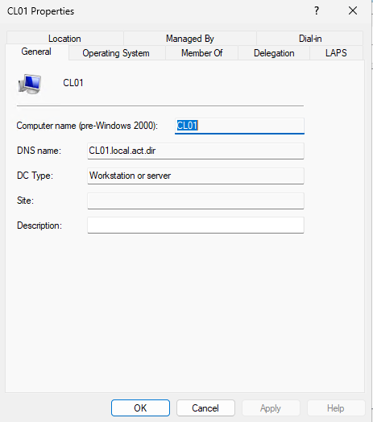

# Active Directory Using Microsoft Azure

## Overview

Deployed an enterprise-style Active Directory environment in Microsoft Azure using Windows Server 2025 x64 Gen2.

The lab simulates a small business Active Directory environment by deploying a domain controller, configuring DNS, creating Organizational Units (OUs), managing domain users and security groups, joining a Windows client (also on Azure) to the domain, and applying Group Policy.

---

## Table of Contents

- [Technologies](#technologies)
- [Environment](#environment)
- [Project Objectives](#project-objectives)
- [Implementation](#implementation)
  - [1. Domain Controller Deployment (DC01)](#1-domain-controller-deployment-dc01)
  - [2. Organizational Unit Design](#2-organizational-unit-design)
  - [3. User & Group Management](#3-user--group-management)
  - [4. Client Deployment (CL01)](#4-client-deployment-cl01)
  - [5. Group Policy](#5-group-policy)
  - [6. Delegated Administration](#6-delegated-administration)
- [Challenges & Troubleshooting](#challenges--troubleshooting)
  - [Client (CL01) Could Not Join the Domain (DC01)](#client-cl01-could-not-join-the-domain-dc01)
  - [Remote Desktop Login Failed for Domain User](#remote-desktop-login-failed-for-domain-user)
- [Skills & Experience Gained](#skills--experience-gained)

## Technologies

- Microsoft Azure
- Windows Server 2025 x64 Gen2
- Active Directory Domain Services (AD DS)
- DNS
- Group Policy Management
- Remote Desktop (RDP)
- PowerShell

---

## Environment

| Machine | Operating System | Purpose |
|----------|------------------|----------|
| DC01 | Windows Server 2025 x64 Gen2 | Domain Controller, DNS Server |
| CL01 | Windows Server 2025 x64 Gen2 | Domain-joined Client |

**Active Directory Domain**: local.act.dir

---

## Project Objectives

- Deploy a Windows Server domain controller
- Create a new Active Directory forest
- Configure DNS
- Design an Organizational Unit structure
- Create users and security groups
- Join a Windows client to the domain
- Configure domain-wide password policies
- Delegate password reset permissions to Helpdesk

---

## Implementation

### 1. Domain Controller Deployment (DC01)

- Created an Azure Windows Server virtual machine
- Assigned a static private IP address
- Installed Active Directory Domain Services
- Promoted the server to a new forest
- Configured the domain: _local.act.dir_

  


---

### 2. Organizational Unit Design

Created a logical Active Directory structure that separates users, computers, and departments.

```
local.act.dir

├── _Branches
│
└── San Francisco
    ├── Users
    ├── Workstations
    └── Laptops

└── _Groups
    ├── Accounting
    ├── Helpdesk
    └── ITSupport
```



---

### 3. User & Group Management

Created multiple domain users and organized them using security groups.

Example:

| User | Group |
|------|---------|
| Walter Grey | Accounting |
| Jesse James | ITSupport |
| Michael Himmy | Helpdesk |





---

### 4. Client Deployment (CL01)

Provisioned a client VM and:

- Configured DNS
- Joined the client to the domain
- Verified domain authentication
- Confirmed the computer object appeared inside Active Directory




---

### 5. Group Policy

Configured domain-wide password policies.

Implemented:

- Minimum password length
- Maximum password age

These settings automatically apply to domain users.

---

### 6. Delegated Administration

Granted the Helpdesk security group permission to:

- Reset user passwords
- Force password changes at next logon

without assigning Domain Administrator privileges.

---
## Challenges & Troubleshooting

### Client (CL01) Could Not Join the Domain (DC01)

#### Problem

The client could not join the `local.act.dir` domain.

#### Observations

- Windows could not locate the domain.
- `nslookup local.act.dir` failed.
- The Domain Controller responded successfully to `ping`.
- The client's preferred DNS server was correctly set to the Domain Controller.

#### Investigation

- Verified the Domain Controller was running properly.
- Confirmed DNS configuration on both the client and server.
- Confirmed network connectivity between the client and the Domain Controller.

#### Root Cause

The client VM had been deployed to a different Azure Virtual Network than the Domain Controller, preventing proper domain communication.

#### Resolution

- Deleted the incorrectly configured client VM.
- Recreated the client VM in the same Azure Virtual Network as the Domain Controller.
- Successfully joined the client to the `local.act.dir` domain.

#### Verification

- The client joined the domain successfully.
- The `CL01` computer object appeared in Active Directory.
- Domain authentication completed successfully after restarting the client.

#### Lessons Learned

Active Directory depends heavily on both DNS and correct network configuration. Even when basic connectivity (such as `ping`) succeeds, an incorrect virtual network (VN) configuration can still prevent domain services from functioning correctly. A good rule of thumb is to always make sure that domain and the client share the same VN before troubleshooting as this will save lots of time.
### Remote Desktop Login Failed for Domain User

#### Problem

A standard domain (Walter Grey) user was unable to sign in to CL01 using Remote Desktop.

#### Investigation

- Verified the user account existed and was enabled through AD.
- Confirmed the client was successfully joined to the domain.
- Verified domain authentication was functioning correctly.

#### Root Cause

The user did not have permission to log on through Remote Desktop.

#### Resolution

Added the user to the local **Remote Desktop Users** group on CL01 and verified successful Remote Desktop authentication.

#### Lessons Learned

Joining a computer to a domain does not automatically grant Remote Desktop access. Users must also be assigned the appropriate local permissions.

---

## Skills & Experience Gained

This project provided hands-on experience deploying and administering an Active Directory environment from scratch.

Along the way I gained practical experience troubleshooting DNS resolution, Azure networking issues, client domain joins, delegated administration, and Group Policy configuration while following common enterprise organizational practices to the best of my abilities. 
